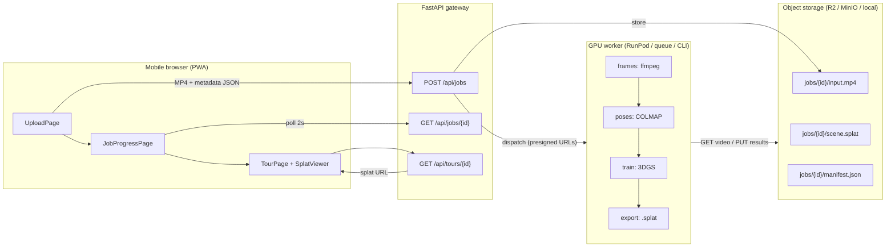

# SpatialScan — System Architecture

> תקציר בעברית בסוף המסמך · PRD: [PRD.he.md](PRD.he.md) / [PRD.en.md](PRD.en.md)

## 1. High-level data flow

## 2. Repository layout

| Path | Role |
|---|---|
| `apps/web` | Vite + React + TS. Routes: `/` (upload), `/jobs/:id` (progress), `/tour/:id` (viewer). `/tour/sample` loads the committed demo scene with no backend. |
| `services/api` | FastAPI. Validates uploads, owns job state (Redis hash `job:{id}`, TTL 7d), abstracts storage and worker triggering. |
| `services/worker` | Python pipeline. One `run_pipeline()`; entrypoints: `queue_worker` (BRPOP loop), `runpod_handler` (serverless), `cli` (Colab/GCP/laptop). |
| `scripts/` | `generate_sample_splat.py` — regenerates the demo asset deterministically. |
| `notebooks/` | Colab notebook running the real pipeline on a free T4. |
| `infra/` | RunPod endpoint + production deployment notes. |

## 3. Environment matrix

| | Storage backend | Job trigger | Pipeline mode | Services needed |
|---|---|---|---|---|
| **Local demo** (`make demo`) | `local` (disk + `/media` routes) | `inline` (thread in API process) | `mock` | none |
| **docker-compose** | `s3` → MinIO | `redis` queue | `mock` | redis, minio |
| **Colab / GCP VM** | local paths via CLI | manual | `real` (or `auto`) | GPU + COLMAP + nerfstudio |
| **Production** | `s3` → Cloudflare R2 | `runpod` (HTTPS) | `real` | RunPod endpoint, R2 |

Every switch is an environment variable (see [.env.example](../.env.example)) — no code changes between environments.

## 4. Key design decisions

### One pipeline, three entrypoints
`spatialscan_worker.pipeline.run_pipeline()` is the only orchestrator. The Redis queue worker, the RunPod serverless handler, and the CLI are thin adapters around it (plus `process_payload()` for the presigned-URL transport). This keeps dev/test/prod behavior identical by construction.

### Presigned URLs as the worker contract
Payload shape: `{job_id, video_url, splat_put_url, manifest_put_url, metadata}`. The GPU container never holds storage credentials, and the same payload works for MinIO, R2, and S3. In local mode the API itself serves `GET/PUT /media/{key}` as the "presigned" endpoints.

### Mock-first pipeline (`PIPELINE_MODE=mock|auto|real`)
Each stage has a real and a mock implementation; `auto` probes per stage (`capabilities.py`: ffmpeg / COLMAP / nerfstudio / CUDA). The mock train stage emits a deterministic procedural room (`synthetic.py`), so the full product loop — upload → queue → process → store → walk through the tour — is verifiable on a laptop and in CI with no GPU.

### The `.splat` interchange format
antimatter15 layout, 32 bytes per splat: position `3×f32`, scale `3×f32`, RGBA `4×u8`, rotation quaternion `4×u8` (w-first, mapped [-1,1]→[0,255]). `splat_format.py` is the single reader/writer shared by the mock generator, the PLY converter (`ply_io.py`, applies the standard 3DGS activations: `exp(scale)`, `sigmoid(opacity)`, `0.5 + C0·f_dc`), the size-budget pruner, tests, and the demo asset. The web viewer loads it natively.

### Export size budget
`export.py` prunes least-significant splats (opacity × mean scale) until the file fits `SPLAT_MAX_MB` (40MB default). Deterministic: kept splats preserve original order.

### Job state: Redis hash + durable manifest
Live status (stage, progress 0–1, error) lives in `job:{id}` with a 7-day TTL — cheap and fast to poll. The durable record is `manifest.json` next to the `.splat` in object storage; a finished tour survives a Redis wipe. No relational DB until the product needs accounts/queries.

### Viewer choices (60 FPS on phones)
- `@mkkellogg/gaussian-splats-3d` with plain Three.js (no React Three Fiber — the library owns its render loop).
- `sharedMemoryForWorkers: false` → no COOP/COEP headers → deployable on any static host; sorting still runs in a worker, just without SharedArrayBuffer.
- `sceneRevealMode: Instant` — the library's default radial reveal advances per rendered frame and leaves scenes looking clipped on slow devices (found via headless-browser testing). Progressive loading already provides the blurry→sharp effect.
- `devicePixelRatio` capped at 2; splat-count budget enforced at export time.
- First-person controls lock eye height (no flying) — motion-sickness mitigation.

## 5. API surface

| Endpoint | Purpose |
|---|---|
| `POST /api/jobs` (multipart: `video`, `metadata` JSON) | Validate (type, ≤45s from metadata, byte cap) → store video → create job → dispatch trigger. Returns `{job_id}`. 413/415/422 on violations. |
| `GET /api/jobs/{id}` | Live status `{status, stage, progress, error, tour_url}`. In RunPod mode, proxies/maps the endpoint's `/status/{rp_id}`. |
| `GET /api/tours/{id}` | `{splat_url, manifest}` once done; 404 while processing. |
| `GET/PUT /media/{key}` | Local-storage mode only (dev). |
| `GET /healthz` | Liveness + active trigger/storage modes. |

## 6. Failure model

- Worker exceptions → job hash `status=error` + message; UI surfaces it with a retry path (new upload).
- Malformed queue payloads are logged and dropped (no poison-pill loop).
- Redis loss: in-flight jobs are lost (acceptable for MVP), finished tours remain servable from storage manifests.
- RunPod failures surface through status mapping (`FAILED`/`CANCELLED`/`TIMED_OUT` → `error`).

---

## תקציר בעברית

- **זרימה:** דפדפן מעלה MP4 + מטא-דטה → FastAPI שומר באחסון S3-תואם ופותח Job ב-Redis → ה-worker (תור Redis בפיתוח / RunPod Serverless בפרודקשן) מוריד את הוידאו ב-presigned URL, מריץ ffmpeg→COLMAP→אימון 3DGS→ייצוא `.splat` עם תקציב 40MB, ומעלה תוצאות חזרה → הדפדפן מציג סיור first-person ב-Three.js.
- **החלטה מבנית מרכזית:** פייפליין אחד עם שלושה entrypoints (תור / serverless / CLI) — התנהגות זהה בפיתוח, בטסטים על Colab ובפרודקשן.
- **mock-first:** כל שלב קיים גם כ-mock; `PIPELINE_MODE=auto` בוחר לפי הכלים המותקנים. כך כל המערכת נבדקת ללא GPU, כולל ב-CI.
- **אבטחה:** קונטיינר ה-GPU לא מחזיק סודות אחסון — רק presigned URLs.
- **עמידות:** מצב חי ב-Redis (TTL שבוע); התוצר העמיד הוא `manifest.json` + `scene.splat` באחסון.
